# Active Directory Home Lab

A virtual Windows domain built in Oracle VirtualBox to practice Tier 1 help desk work: account management, Group Policy, file share permissions, and troubleshooting. Every task was then documented as a ticket in Jira Service Management, from customer request to resolution.

## Lab Environment

| Machine | OS | Role |
|---|---|---|
| DC | Windows Server 2019 | Domain controller for mydomain.com running Active Directory, DNS, DHCP, and NAT routing |
| CLIENT1 | Windows 10 | Domain joined workstation used to test every change as an end user |

The DC has two network adapters: one connected to the internet through VirtualBox NAT, and one on an internal network shared with CLIENT1. CLIENT1 gets its IP address from the DC's DHCP server and reaches the internet through the DC. A PowerShell script populated the domain with 1,000 test users in the _USERS OU.

**Tools used:** Oracle VirtualBox, Active Directory Users and Computers, Group Policy Management, PowerShell, Jira Service Management

## Help Desk Tasks

### 1. Onboarding a New Hire
Created the account for HelpDesk User in ADUC with a temporary password and "User must change password at next logon" enabled. Signed in on CLIENT1 and confirmed the forced password change.

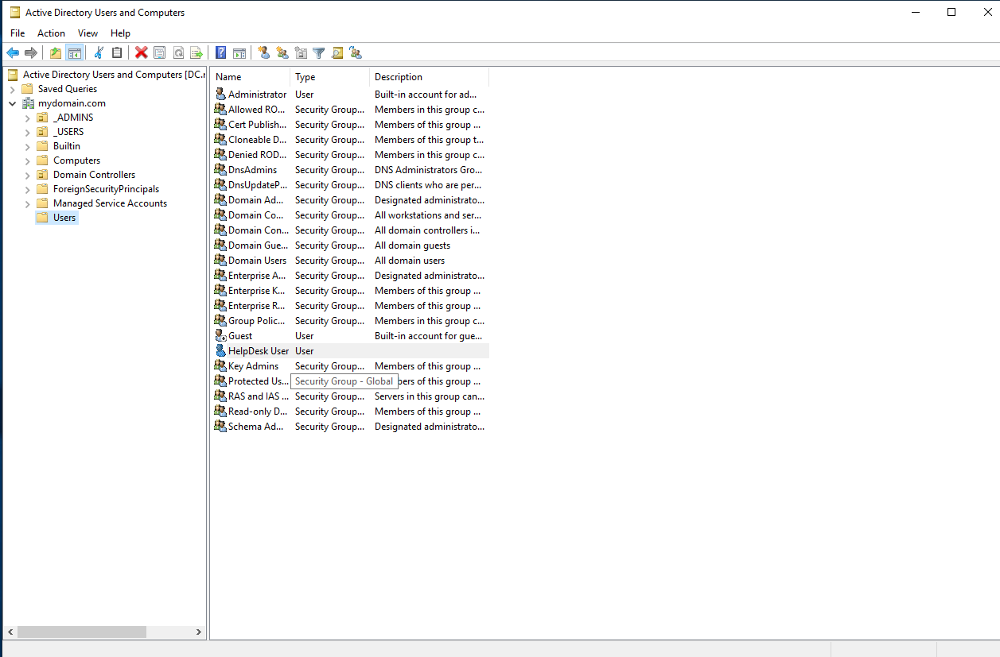

### 2. Password Reset
Located the user in ADUC using Find, reset the password, and required a new password at next logon. Confirmed the user could sign in and set a new password.

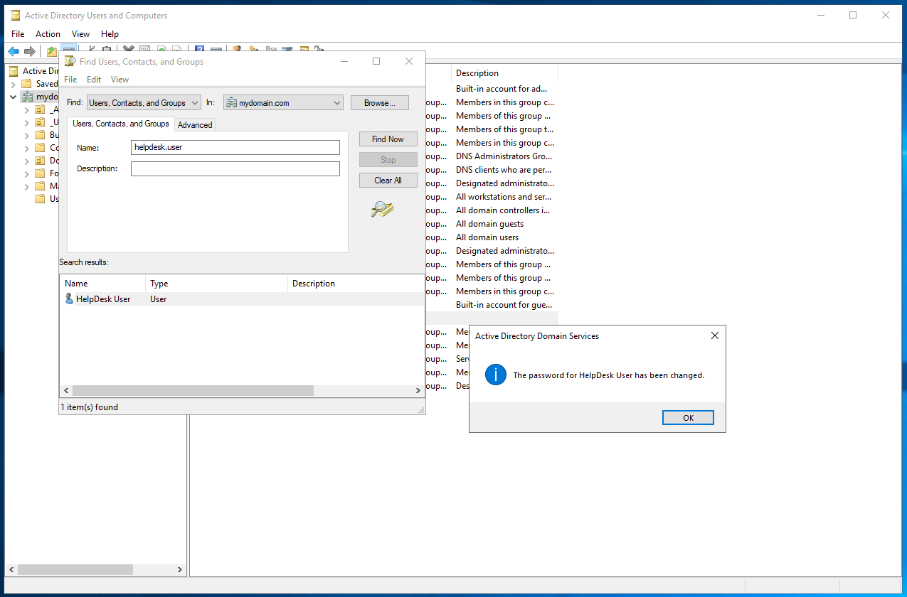

### 3. Account Lockout Policy
Configured the Default Domain Policy to lock an account after 3 failed sign in attempts for 10 minutes. Ran gpupdate and confirmed the account locked after the third failed attempt.

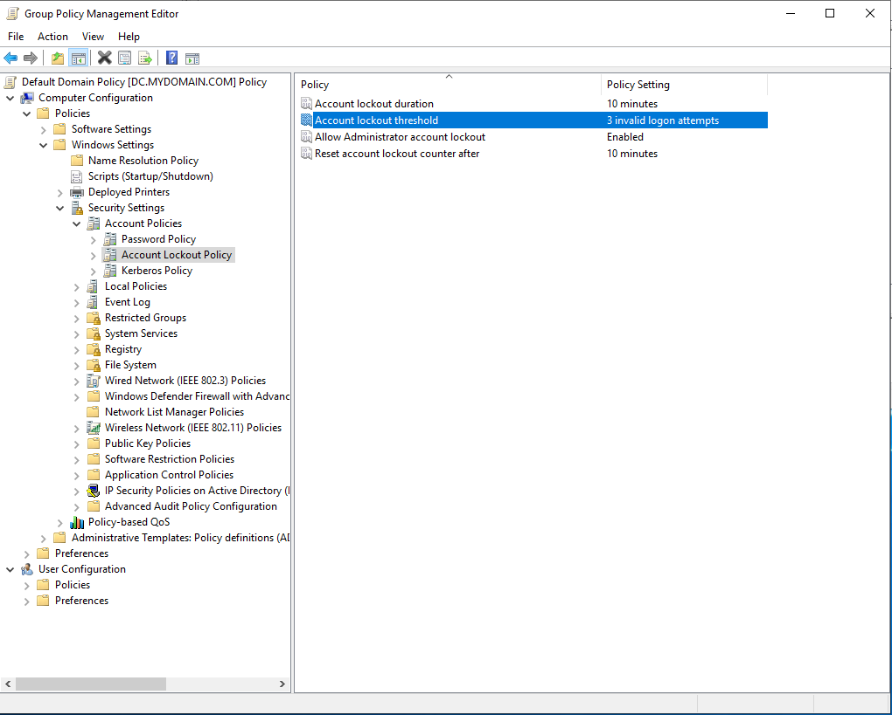

### 4. Unlocking an Account
Unlocked the account from the Account tab in ADUC and confirmed the user could sign in again.

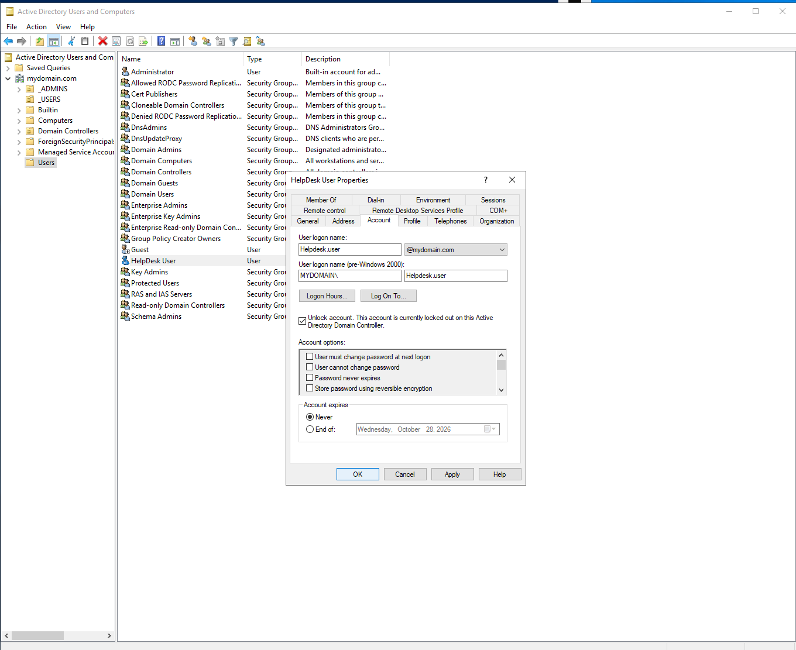

### 5. Blocking Control Panel with Group Policy
Created a GPO that prohibits access to Control Panel and linked it to the _EMPLOYEES OU. The policy did not apply at first because HelpDesk User was still in the default Users container, which a GPO cannot be linked to. After moving the user into _EMPLOYEES, the restriction applied on CLIENT1.

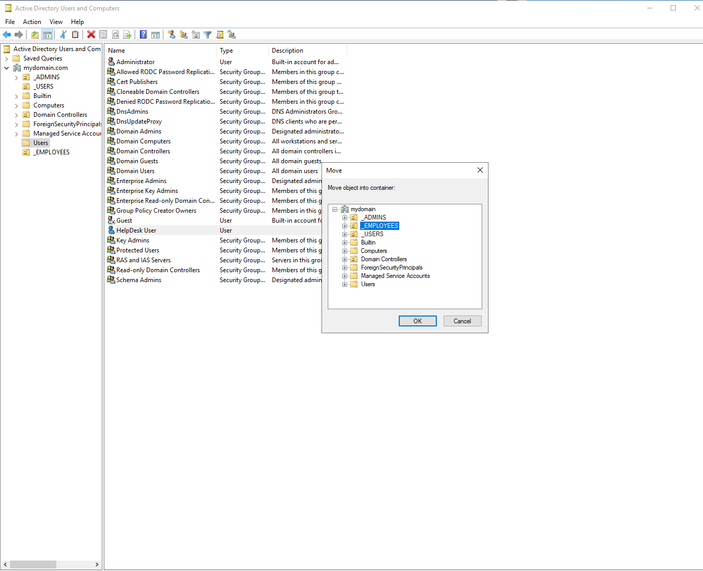
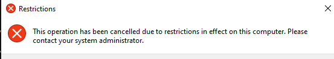

### 6. Shared Folder Access with a Security Group
Created a Marketing security group, added HelpDesk User, and shared a Marketing folder with Modify permissions granted to the group rather than to individual users. Confirmed access by creating a test file from CLIENT1.

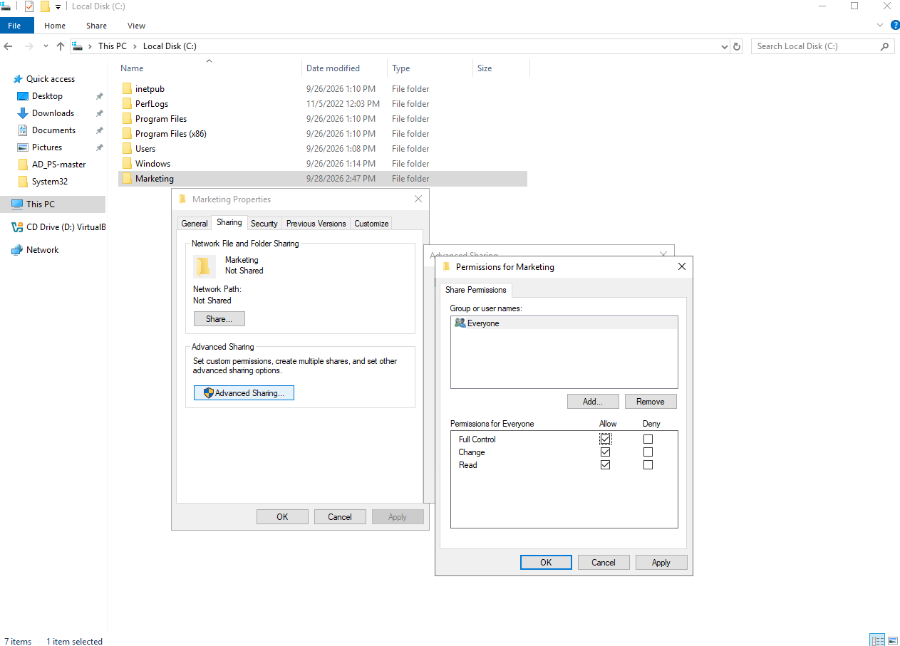
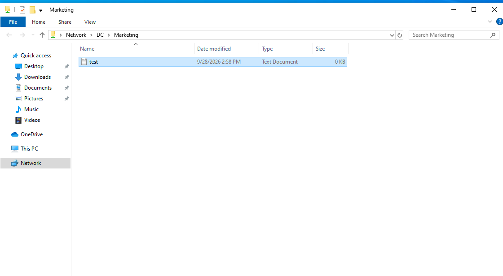

### 7. Offboarding
Disabled the departing user's account instead of deleting it, which preserves group memberships and file ownership for auditing. Confirmed the sign in was blocked on CLIENT1.

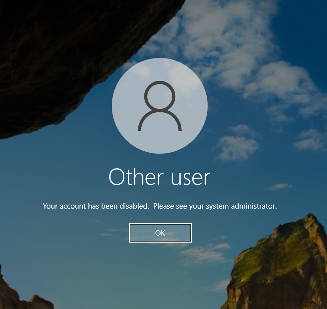

## Troubleshooting

### Guest Additions install failed for a standard user
**Issue:** CLIENT1 had display problems because VirtualBox Guest Additions were missing, and the installer failed when run as a standard domain user.
**Cause:** Installing drivers requires administrator rights.
**Fix:** Ran the installer with Run as administrator using domain admin credentials. The install completed and the display issue was resolved.

### Marketing folder open to all domain users
**Issue:** While testing the Marketing share, I found the folder was inheriting a broad Users permission from C:\, which would have let every domain user open it.
**Cause:** NTFS permission inheritance from the parent drive.
**Fix:** Disabled inheritance on the Marketing folder and removed the inherited Users entries, leaving access only to the Marketing group and administrators. Signed in as a domain user outside Marketing and confirmed access was denied.

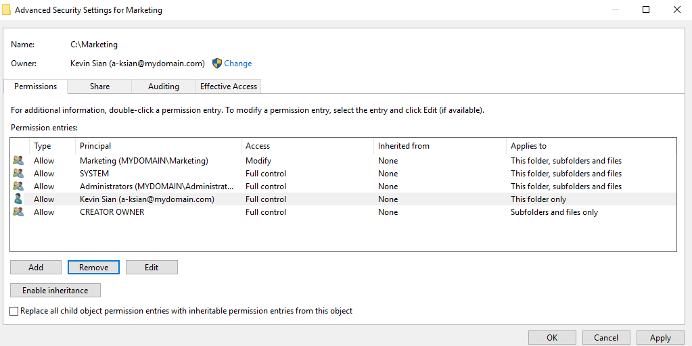
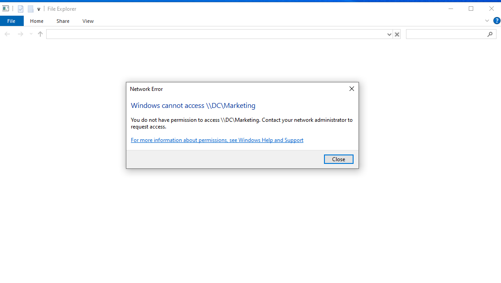

## Ticket Documentation in Jira Service Management

All 9 tasks and incidents were logged in Jira Service Management: 7 service requests and 2 incidents. Each ticket was submitted through the customer portal, assigned, worked with an internal note documenting the steps and screenshots, answered with a customer facing reply, and resolved within SLA. The permissions incident is linked to the original folder access request.

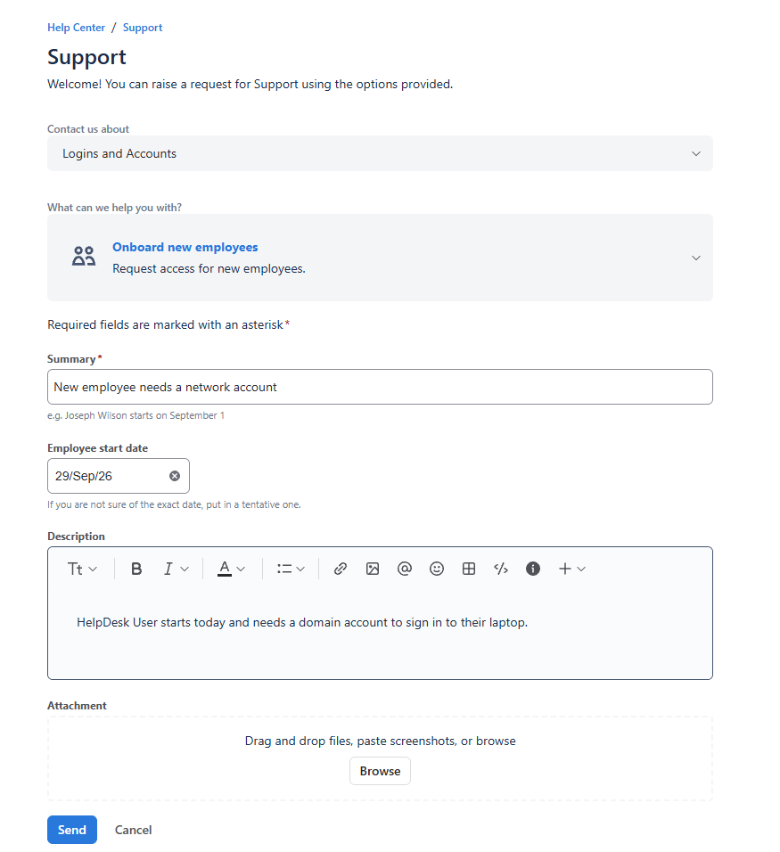
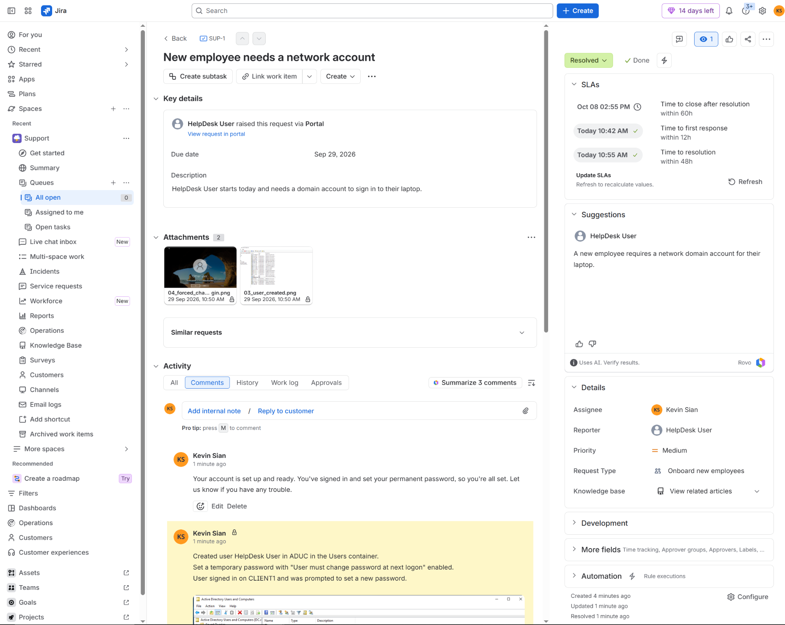
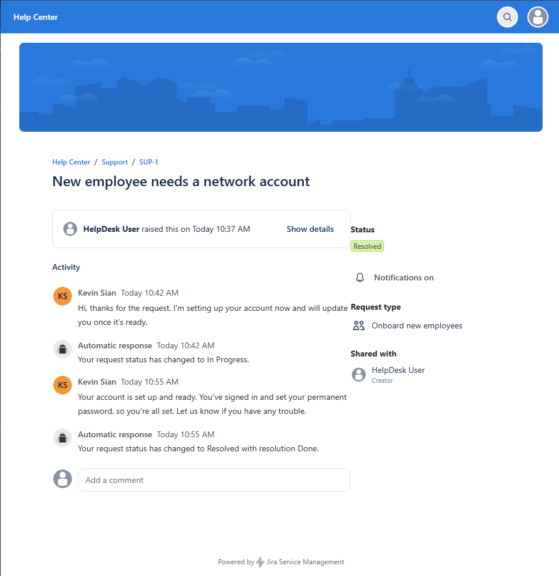
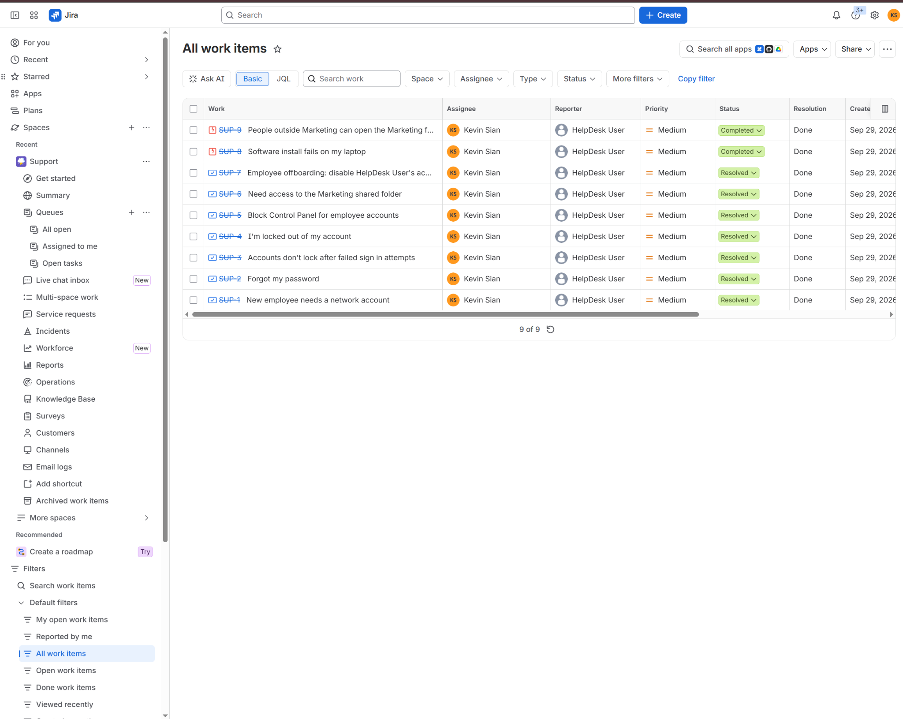

## Skills Demonstrated

Active Directory user and account management, Group Policy creation and linking, OU structure and how it affects policy scope, share and NTFS permissions, least privilege access through security groups, secure offboarding, structured troubleshooting, and ticket documentation in an ITSM tool.
